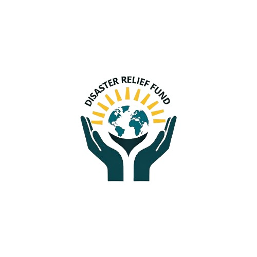

#  KarunyaSetu: Decentralized Disaster Relief Protocol

) 

## Introduction

**KarunyaSetu** is a **decentralized disaster relief platform** powered by smart contracts, DAO governance, and zkProofs. Designed to eliminate corruption, delays, and inefficiencies in traditional systems, KarunyaSetu connects **verified victims** with **compassionate donors** in a transparent, automated, and tamper-proof environment. The protocol ensures **instant aid delivery**, **on-chain transparency**, and **real-time governance**, redefining how communities respond to crises.

---

## 🚨 The Problem We Solve

Traditional disaster relief is broken:

- ❌ **Delayed fund distribution** due to bureaucracy.
- 🧾 **Fake claims & middlemen** siphoning away resources.
- 🤝 **No direct channel** between donors and real victims.
- 🔒 **Lack of privacy** & identity verification for victims.
- 🔍 **Limited visibility** into how funds are used.

---

## ✅ Our Solution

KarunyaSetu introduces a **DAO-governed**, **smart contract–powered** relief protocol with **zkProof-based victim verification**:

- 🔐 **Zero-Knowledge Verification** – Aadhaar pin + geolocation without exposing identities.
- 🧠 **DAO-Driven Campaigns** – Relief campaigns proposed and approved by the community.
- 💸 **Smart Fund Automation** – Transparent, trustless fund disbursement to verified victims.
- 🎁 **NFT Gratitude Tokens** – Donors receive unique NFTs as badges of contribution.

---

## 🧩 Key Features

✅ **Decentralized Fund Management** – No middlemen or delays.  
✅ **Privacy-Preserving Victim Authentication** – zkProofs for identity + location verification.  
✅ **DAO Voting System** – Campaigns initiated and voted on by the community.  
✅ **Automated Payouts** – Funds reach victims instantly through smart contracts.  
✅ **Real-Time Transparency** – Every transaction is auditable on-chain.  
✅ **Donor NFTs** – Custom NFTs as proof of compassion and support.

---

## 📂 Project Structure

KarunyaSetu/
├── contracts/         → Solidity smart contracts
├── frontend/          → React.js user interface
├── backend/           → APIs for victim validation
├── docs/              → Diagrams, design specs, and whitepapers
└── README.md

📘 Detailed module guides:  
- [🧾 Contracts README](./contracts/README.md)  
- [🌐 Frontend README](./frontend/README.md)

---

## 🛠 Tech Stack

### 🧠 Blockchain & Contracts:
- **Solidity** – Smart contracts for DAO, fund management.
- **zkProofs** – Victim verification via Aadhaar + GPS data.
- **EVM Compatible** – Deployable across Ethereum/Layer 2 chains.

### 🖥 Frontend:
- **React.js** – Web interface for campaign creation, voting, and tracking.
- **Tailwind CSS** – Responsive and clean design.
- **Wallet Integration** – MetaMask, WalletConnect, and other Web3 wallets.

### 🔗 Backend:
- **Node.js** – APIs for victim validation and campaign management.
- **Base Onchain Kit** – Blockchain wallet & contract interaction.

---

## 📊 How It Works

1. 🗳 **Campaign Proposal** – DAO members propose relief efforts.
2. 🧑‍⚖️ **Voting** – DAO votes to approve or reject proposals.
3. 👤 **Victim Registration** – zkProof-based Aadhaar & GPS validation.
4. 💸 **Fund Distribution** – Smart contracts disburse donations directly to victims.
5. 🧾 **On-chain Records** – Full transparency for all stakeholders.

---

## 🌐 Future Enhancements

🚀 **Discord DAO Bot** – Voting, fund updates, and proposals in real time.  
📢 **National Disaster Alert Integration** – Real-time DAO proposal triggers.  
🪪 **Social Media Donor Badges** – NFT or QR-coded badges for donor recognition.  
🕒 **Live Countdown Timers** – Registration, voting, and funding phases.  
📊 **Donor Dashboards** – Personalized giving history and impact insights.

---

## 🌍 Real-World Use Cases

- 🌀 **Flood, Earthquake, Fire Relief** – Quick distribution of verified aid.
- 🏥 **Medical Emergencies** – Critical help in outbreaks and health crises.
- 🧑‍🎓 **Student Aid** – DAO-driven campaigns for displaced or disaster-affected students.
- 🧾 **Corporate CSR & NGO Collaboration** – Transparent giving with on-chain proof.
- 🇮🇳 **Government Partnerships** – National-scale adoption with trustless verification.

---

## 🔗 Live Network & Wallet Guide

KarunyaSetu runs on **EVM-compatible testnets**.

🔹 **Test Tokens**: Request test ETH or tokens from [Alchemy Sepolia Faucet](https://sepoliafaucet.com).  
🔹 **Supported Wallets**: MetaMask, WalletConnect, Brave Wallet.

---

## 👥 Contributors

👨‍💻 **[Nandeesh (0x02Auditor)](https://twitter.com/0x02Auditor)** – Smart Contracts, DAO Governance  
🎨 **[Sribabu (5r1b4bu)](https://x.com/5R1B4BU)** – Full Stack UI/UX & React  
💻 **[Bhanu Teja](https://twitter.com/BhanuTeja)** – Backend Integration

---

## 📸 Screenshots

  
**Web App**: The main interface of KarunyaSetu, where users can create campaigns, donate, and track relief efforts in real time.

  
**About**: Learn about KarunyaSetu's mission to provide fast, transparent, and decentralized disaster relief with no middlemen.

  
**DAO Flow**: A visual representation of the decentralized governance process, from campaign proposal to fund distribution.

  
**Team**: Meet the dedicated contributors behind KarunyaSetu, driving innovation in disaster relief.

## 🎯 Join the KarunyaSetu Movement

**Disasters demand fast, fair, and fearless action.**  
KarunyaSetu empowers people to help **without red tape**, **without corruption**, and **without borders**.

🔗 Predict. Propose. Protect. Together.

📌 [Website] • [Docs] • [DAO Portal] • [Twitter](https://x.com/5R1B4BU)
